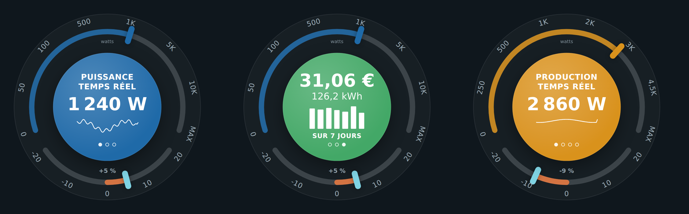

# ⚡ HOLM Ecojoko Card

[](https://hacs.xyz/)


**Le célèbre cadran de consommation, dans Home Assistant : la puissance en direct, le coût du jour, la semaine, et si vous consommez plus ou moins que d'habitude.**

HOLM Ecojoko Card reprend l'esprit du cadran Ecojoko : une grande jauge de puissance à échelle logarithmique, un disque central qui fait défiler plusieurs informations, et une petite jauge qui indique si **aujourd'hui vous consommez plus ou moins que d'habitude**. Elle fonctionne avec n'importe quel compteur (Ecojoko, Linky, pince ampèremétrique…) et a aussi un **mode production solaire**.

> ✨ **Aucun helper.** Les chiffres du jour et de la semaine viennent des statistiques de Home Assistant. Tout se règle dans l'éditeur visuel.

### En bref

- 🎯 **Puissance en temps réel** sur une jauge 0 → 10 kW (échelle réglable), avec la courbe de la dernière heure.
- 💶 **Aujourd'hui** : kWh et coût, avec vos prix heures creuses / heures pleines (nombres ou entités).
- 📊 **Sur 7 jours** : coût, kWh et barres par jour.
- ↕️ **Écart du jour** : comparaison avec la moyenne des 7 derniers jours **aux mêmes heures** (+5 %, −9 %…).
- ☀️ **Mode production solaire** : production en direct, du jour, de la semaine et autoconsommation, avec valorisation (prix autoconsommé / prix de revente).
- 🔄 Défilement automatique des informations (ou manuel), couleurs personnalisables, taille réglable.



---

## Installation

### Avec HACS (recommandé)

1. HACS → menu ⋮ → **Dépôts personnalisés**.
2. Ajoutez `https://github.com/kaaribou/holm-ecojoko-card`, catégorie **Tableau de bord** (*Dashboard / Plugin*).
3. Recherchez la carte → **Télécharger**.
4. Rechargez la page (Ctrl + F5).

### Manuellement

1. Copiez `dist/holm-ecojoko-card.js` dans `config/www/community/holm-ecojoko-card/`.
2. **Paramètres → Tableaux de bord → ⋮ → Ressources → Ajouter** : `/local/community/holm-ecojoko-card/holm-ecojoko-card.js`, type **Module JavaScript**.
3. Rechargez la page.

---

## Utilisation

```yaml
type: custom:holm-ecojoko-card
power: sensor.puissance_maison            # W, temps réel
energy_hc: sensor.energie_heures_creuses  # kWh, total_increasing
energy_hp: sensor.energie_heures_pleines
price_hc: 0.2068                          # ou une entité (input_number…)
price_hp: 0.27
```

**Mode production solaire :**

```yaml
type: custom:holm-ecojoko-card
mode: solar
power: sensor.puissance_solaire
energy: sensor.production_solaire         # kWh
export_energy: sensor.energie_revendue    # kWh (optionnel)
price_self: 0.2516                        # valeur d'un kWh autoconsommé
price_export: 0.04                        # prix de revente
```

## Options

| Option | Description | Par défaut |
|---|---|---|
| `mode` | `conso` (consommation) ou `solar` (production) | `conso` |
| `power` | Puissance en temps réel, en W (**obligatoire**) | — |
| `energy_hc` / `energy_hp` | Énergie consommée en heures creuses / pleines (kWh) | — |
| `price_hc` / `price_hp` | Prix du kWh HC / HP : nombre ou entité | — |
| `solar_power` / `solar_energy` / `export_energy` | En mode conso : ajoute une page « solaire » | — |
| `energy` / `price_self` / `price_export` / `forecast` | Mode solaire : production (kWh), valeurs du kWh, prévision | — |
| `max_power` | Puissance maximale de la jauge (W) | `12000` (6000 en solaire) |
| `scale` | Graduations de la jauge | `0, 50, 100, 500, 1000, 5000, 10000` |
| `rotate_seconds` | Défilement automatique (0 = désactivé) | `10` |
| `title` / `title_position` | Titre, en haut ou en bas | — |
| `size` / `show_frame` | Taille du cadran, cadre de la carte | — |
| `colors` | Couleurs de chaque page (`power`, `today`, `week`, `solar`…) | bleu / turquoise / vert / or |

## FAQ

| Problème | Solution |
|---|---|
| Pas de coût | Indiquez `price_hc` / `price_hp` (ou `price_self` / `price_export` en solaire). |
| Pas d'écart du jour | Il faut au moins une journée complète d'historique sur les 7 derniers jours. |
| La nouvelle version ne s'affiche pas | Videz le cache (Ctrl + F5). |

> Carte indépendante, sans lien avec la société Ecojoko : elle s'inspire simplement de son cadran.

---

## Un petit merci ?

La carte vous plaît ? Vous pouvez m'offrir une bière 🍺

[](https://paypal.me/kaaribou)

---

## Licence

Code : licence **MIT** — © kaaribou. Voir le [CHANGELOG](CHANGELOG.md).

Fait partie de la collection **HOLM** : [Carburant HOLM](https://github.com/kaaribou/carburant-holm) · [HOLM Navbar Card](https://github.com/kaaribou/holm-navbar-card) · [HOLM Music Card](https://github.com/kaaribou/holm-music-card) · [HOLM Sentinel Card](https://github.com/kaaribou/holm-sentinel-card).
